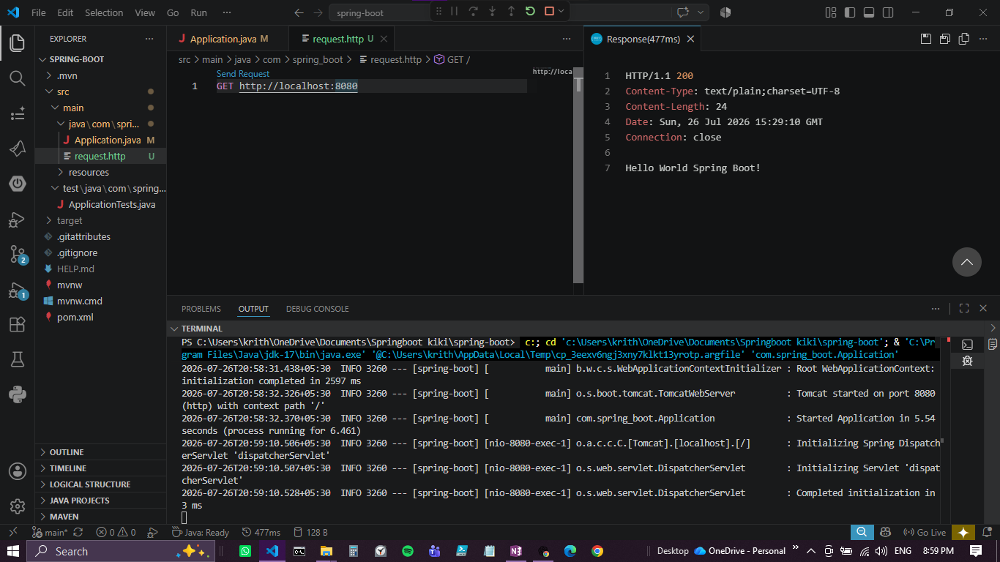
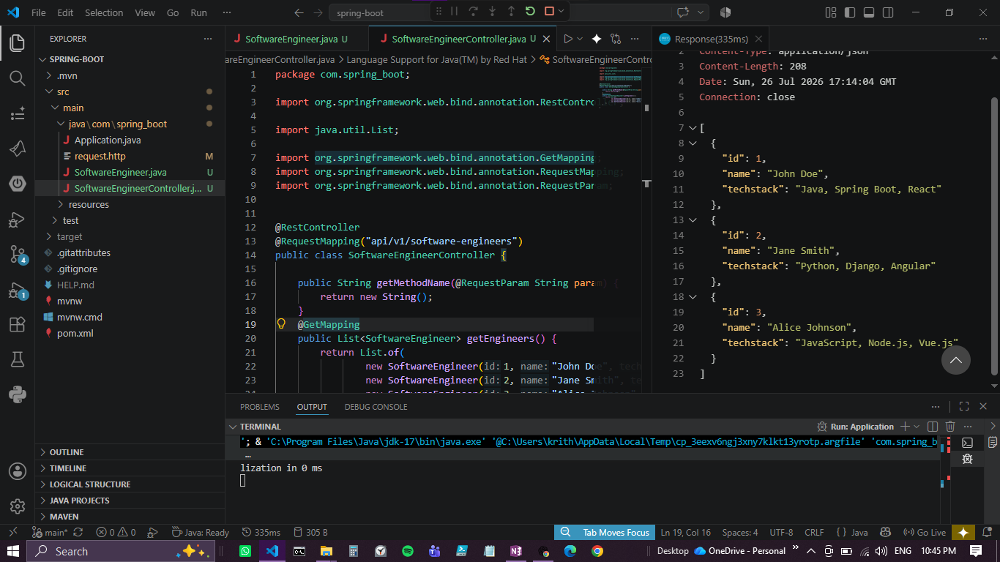
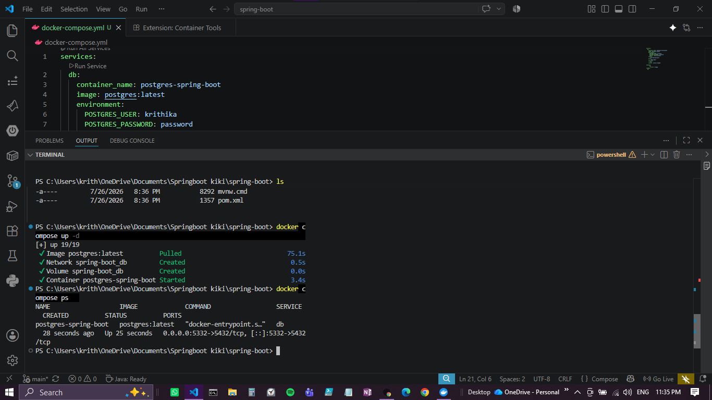
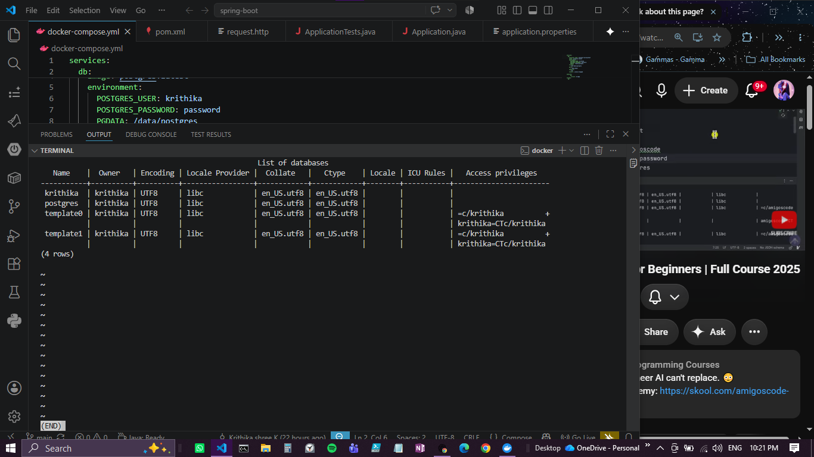
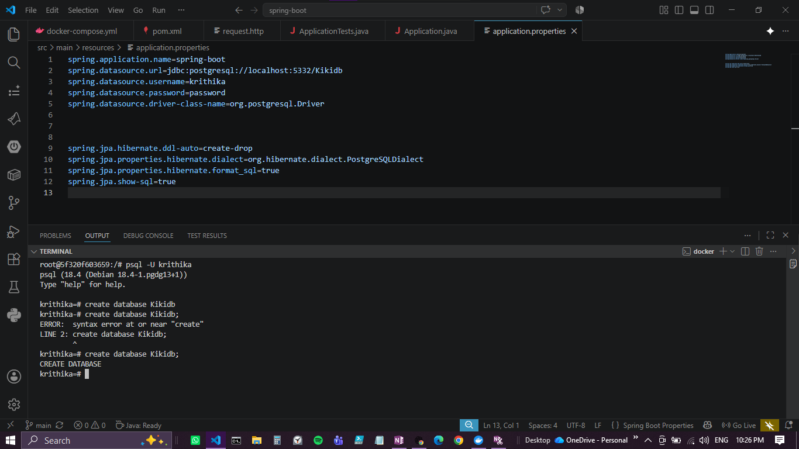
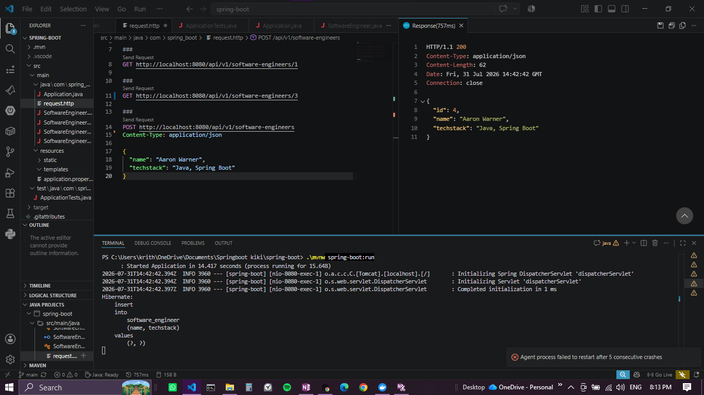
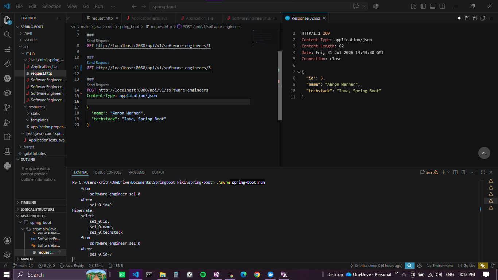

# Spring Boot Demo Application

A beginner-friendly Spring Boot demo project built to learn how to create a REST API, connect it to PostgreSQL, run it through Docker, and debug common Spring/JPA issues in a practical way.

You can enter software engineer details into the application; when an ID is sent in a request (for example `GET /api/v1/software-engineers/{id}`), the REST endpoint will return the software engineer's ID and name.

## Project Overview

This project demonstrates a simple Spring Boot application that:

- starts a Spring Boot server
- exposes REST endpoints for software engineers
- maps a JPA entity to PostgreSQL
- uses Docker Compose to run the database
- supports manual HTTP testing with a `.http` file

## Demo Features

The application includes the following learning/demo features:

- `GET /api/v1/software-engineers` to fetch all records
- `GET /api/v1/software-engineers/{id}` to fetch one record by ID
- `POST /api/v1/software-engineers` to insert a new software engineer
- JPA entity mapping with Hibernate
- PostgreSQL connection using Spring Data JPA
- Docker-based database setup for local development

## Tech Stack

- Java 17
- Spring Boot 4.1.0
- Spring Web MVC
- Spring Data JPA
- Hibernate ORM
- PostgreSQL
- Docker Compose
- Maven

## Project Structure

- `src/main/java/com/spring_boot/Application.java` — main Spring Boot application entry point
- `src/main/java/com/spring_boot/SoftwareEngineer.java` — JPA entity model
- `src/main/java/com/spring_boot/SoftwareEngineerController.java` — REST controller
- `src/main/java/com/spring_boot/SoftwareEngineerService.java` — service layer
- `src/main/java/com/spring_boot/SoftwareEngineerRepository.java` — repository layer
- `src/main/resources/application.properties` — datasource and JPA configuration
- `docker-compose.yml` — Postgres container configuration
- `src/main/java/com/spring_boot/request.http` — manual API request examples

## How to Run

1. Start the PostgreSQL container:

```powershell
docker compose up -d
```

2. Run the Spring Boot application with a UTC timezone override to avoid the PostgreSQL timezone alias issue:

```powershell
$env:JAVA_TOOL_OPTIONS="-Duser.timezone=UTC"
.\mvnw spring-boot:run
```

3. Open the API endpoints in your browser or HTTP client.

## API Examples

### Get all engineers

```http
GET http://localhost:8080/api/v1/software-engineers
```

### Get one engineer by ID

```http
GET http://localhost:8080/api/v1/software-engineers/1
```

### Insert a new engineer

```http
POST http://localhost:8080/api/v1/software-engineers
Content-Type: application/json

{
  "name": "Aaron Warner",
  "techstack": "Java, Spring Boot"
}
```

## Issues That Were Fixed During Learning

This project went through several debugging corrections, including:

- fixed the malformed `SoftwareEngineerService` class
- corrected the controller route and HTTP method wiring
- restored the proper JPA entity annotations and constructor structure
- added the repository interface for Spring Data JPA
- cleaned the request mapping issues for `GET` and `POST`
- fixed the database connection setup for PostgreSQL
- corrected the timezone mismatch problem by forcing the application to run with `UTC`

## Screenshots

Below are embedded screenshots — click an image to open the full-size version.















## Notes

This repository was created as a learning/demo version to understand how Spring Boot applications are structured, how REST endpoints are exposed, how JPA entities are mapped, and how a PostgreSQL[...]

👩‍💻 Author

Krithika Shree K
GitHub: @krithikashree1957
